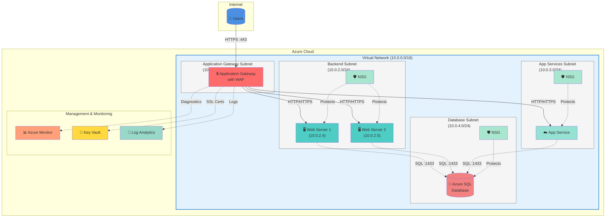

# Azure personal notes and commands

## Network Topology Architecture

The following diagram illustrates a typical Azure network topology with Application Gateway for web application delivery.

### Architecture Components

- **Application Gateway**: Layer 7 load balancer with Web Application Firewall (WAF) protection
- **Backend Pool**: Web servers (VMs) and App Services hosting applications
- **Network Security Groups (NSG)**: Subnet-level security controls
- **Azure SQL Database**: Managed database service with private connectivity
- **Azure Monitor**: Centralized monitoring and diagnostics
- **Key Vault**: Secure storage for SSL certificates and secrets
- **Log Analytics**: Centralized logging and analytics workspace

This is a personal repository for Azure references, CLI commands, PowerShell commands, Documentations links, courses, etc., for my personal use using Azure.
